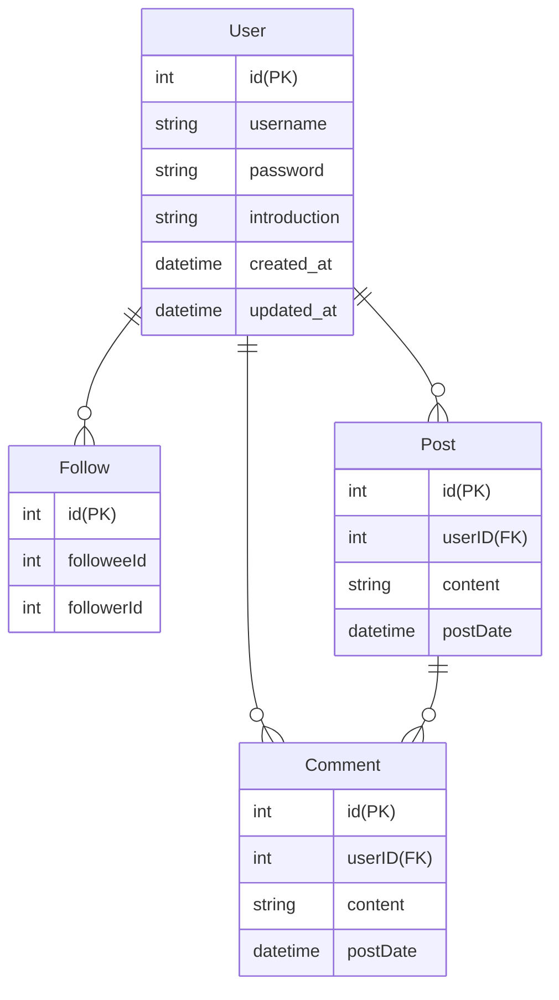

## ER図

```mermaid
erDiagram
  User {
    int id(PK)
    string username
    string password
    string introduction
    datetime created_at
    datetime updated_at
  }
  Follow {
    int id(PK)
    int followeeId
    int followerId
  }
  Post {
    int id(PK)
    int userID(FK)
    string content
    datetime postDate
  }
  Comment {
    int id(PK)
    int userID(FK)
    string content
    datetime postDate
  }
  User ||--o{ Follow : ""
  User ||--o{ Post: ""
  User ||--o{ Comment : ""
  Post ||--o{ Comment : ""
```