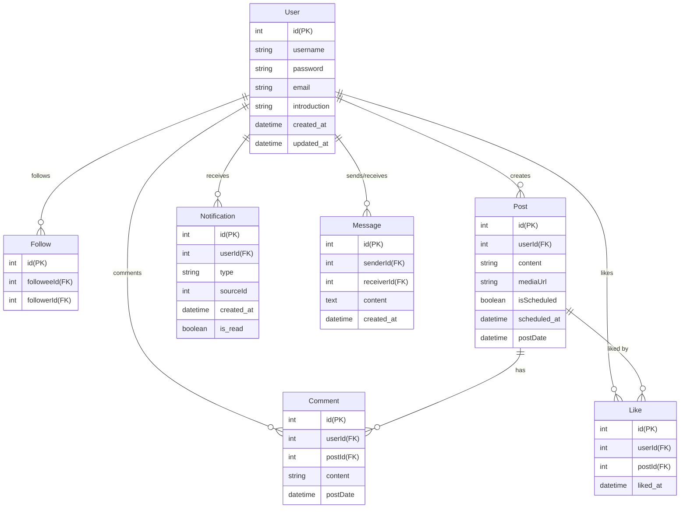

## ER図

```mermaid
erDiagram
  User {
    int id(PK)
    string username
    string password
    string email
    string introduction
    datetime created_at
    datetime updated_at
  }
  Follow {
    int id(PK)
    int followeeId(FK)
    int followerId(FK)
  }
  Post {
    int id(PK)
    int userId(FK)
    string content
    string mediaUrl
    boolean isScheduled
    datetime scheduled_at
    datetime postDate
  }
  Comment {
    int id(PK)
    int userId(FK)
    int postId(FK)
    string content
    datetime postDate
  }
  Like {
    int id(PK)
    int userId(FK)
    int postId(FK)
    datetime liked_at
  }
  Notification {
    int id(PK)
    int userId(FK)
    string type
    int sourceId
    datetime created_at
    boolean is_read
  }
  Message {
    int id(PK)
    int senderId(FK)
    int receiverId(FK)
    text content
    datetime created_at
  }
  User ||--o{ Follow : "follows"
  User ||--o{ Post : "creates"
  User ||--o{ Comment : "comments"
  User ||--o{ Like : "likes"
  User ||--o{ Notification : "receives"
  User ||--o{ Message : "sends/receives"
  Post ||--o{ Comment : "has"
  Post ||--o{ Like : "liked by"
```